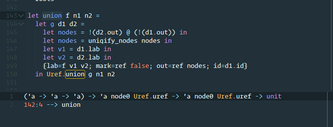

# MLFi

Sublime Text package for [MLFi - the Modeling Language for Finance](https://www.lexifi.com/product/technology/contract-description-language) by [LexiFi](https://www.lexifi.com/)

Find the package useful? [Say thanks by buying me a beer](https://www.paypal.com/cgi-bin/webscr?cmd=_s-xclick&hosted_button_id=V2WZKXYV27338).

# Install

The package can be installed using one of the following methods:

## Via [Package Control](https://packagecontrol.io) (recommended)

`Package Control: Install Package > MLFi`

## Manual

1. `Sublime Menu > Preferences > Browse Packages ...`
2. `git clone https://github.com/li-vu/st-mlfi MLFi`

# Features

- Syntax highlight for both MLFi and [CSML](https://www.lexifi.com/csml) - a high-level language binding between OCaml and C#.
- Detect type of an expression using the annotation.

# License
Copyright (C) 2016 [li-vu](https://github.com/li-vu)

This program is free software: you can redistribute it and/or modify it under the terms of the GNU General Public License as published by the Free Software Foundation. <http://www.gnu.org/licenses/gpl.html>

This program is distributed in the hope that it will be useful, but WITHOUT ANY WARRANTY; without even the implied warranty of MERCHANTABILITY or FITNESS FOR A PARTICULAR PURPOSE. See the GNU General Public License for more details.